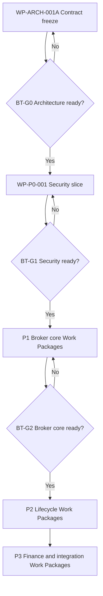

# BizTrust P0–P3 Delivery and Gate Plan

| Field | Value |
|---|---|
| Version | `0.1-draft` |
| Status | `PLANNING BASELINE — AUTHORITY REQUIRED PER WORK PACKAGE` |
| Parent | `BIZTRUST-ARCH-001` |
| Superseded | By [`BIZTRUST-PLAN-001.md`](BIZTRUST-PLAN-001.md) `1.0-draft` for the phases, the epics and the gates: sections 3 to 6 here are retired to a pointer since WP-055 (#169), section 7 is a pointer to PLAN-001 section 10 since WP-051 (#165), and no page or test reads this file's epics. Sections 1, 2, 8, 9, 10 and 11 stand until a ticket carries them: the naming rule, the execution chain, the Work Package decomposition rule, the recommended backlog, the horizon and the exit from planning |

## 1. Naming rule

Two gate systems exist and must never be confused:

| Namespace | Purpose | Examples |
|---|---|---|
| `ENG-G0…ENG-G8` | Lifecycle gate applied to every Work Package | Discover, define, architect, plan, build, assure, release, operate, learn |
| `BT-G0…BT-G7` | BizTrust platform capability milestone | Architecture ready through production ready; the table is `BIZTRUST-PLAN-001.md` section 10 |

`P0…P3` are delivery phases, not approval states. A phase may contain many Work Packages, each moving through the `ENG-G*` lifecycle.

## 2. Controlled execution chain

Architecture acceptance authorizes only the next bounded planning step. It does not grant blanket implementation or production authority.

## 3. to 6. P0 to P3 (retired)

The four phase sections this file held, P0 Architecture and platform foundation, P1 Broker core MVP, P2 Professional brokerage lifecycle and P3 Financial and integration platform, with their 47 epics, the P0 mandatory proof and the P1 vertical-slice acceptance, are retired since WP-055 ([#169](https://github.com/bstBizEra/biztrust_guide/issues/169)). [`BIZTRUST-PLAN-001.md`](BIZTRUST-PLAN-001.md) carries the five phases in its sections 3 to 7, the mandatory proof in its section 4, the vertical-slice acceptance verbatim in its section 5.5, the end-to-end evidence sentence verbatim in its section 6, and every epic of these four sections with its new home in its section 9, except P0.13, which was added to both plans under WP-050 and is unchanged in its section 4. The phase manuals under `phases/` render that document, and `tests/test_phase_pages.py` holds them to it. The retired tables and the vertical-slice acceptance are in this file's history at the WP-054 merge, `cf4eac1`; the mandatory proof was already a pointer there, its lines having moved to PLAN-001 section 4 under WP-052.

## 7. BizTrust architecture gates

The gate table is in [`BIZTRUST-PLAN-001.md`](BIZTRUST-PLAN-001.md) section 10 since WP-049: the seven rows this section held, `BT-G0` to `BT-G6`, are reproduced there verbatim, `BT-G7 Production Ready` is added, and the executive labels A to E are mapped onto the identifiers. The phase overview renders that table and `tests/test_phase_pages.py` holds it to PLAN-001 since WP-051. The rule stands: failure at any gate blocks dependent authorization, and a waiver requires a named human risk owner, expiry, compensating controls and recorded dissent.

## 8. Work Package decomposition rule

Each epic becomes one or more Work Packages containing:

- one bounded outcome and accountable owner;
- explicit in-scope and out-of-scope statements;
- dependencies and architecture contracts;
- risk classification and data classification;
- permitted tools/actions and authority expiry;
- acceptance criteria and independent verifier;
- rollback or compensation strategy;
- evidence manifest requirements;
- checkpoint cadence and one next safe action.

Never open all P0–P3 epics as simultaneously active. Maintain one primary next action and a dependency-ordered queue.

## 9. Recommended immediate backlog

| Order | Work Package | Outcome | Start condition |
|---:|---|---|---|
| 1 | `BIZTRUST-WP-ARCH-001A / ARCH-001A-S01` | Establish tenant authority, jurisdiction and money-regime inputs | Human sponsor confirms reviewers and evidence access |
| 2 | `BIZTRUST-WP-ARCH-001A / S02–S11` | Complete the remaining architecture decisions one accepted slice at a time | Previous slice accepted; see `FOUNDATION_SEQUENCE.md` |
| 3 | `BIZTRUST-WP-P0-001` | Prove the tenant-security vertical slice | `BT-G0` passes |
| 4 | `BIZTRUST-WP-P1-001` | Establish client/risk/distribution-product/submission skeleton | `BT-G1` passes |
| 5 | `BIZTRUST-WP-P1-002` | Complete indication/offer comparison/recommendation | P1-001 evidence accepted |
| 6 | `BIZTRUST-WP-P1-003` | Complete acceptance/authority-supported cover/policy representation | P1-002 evidence accepted |

## 10. Post-P3 horizon

Claims/renewal depth, partner scale, additional isolation tiers, analytics and AI assistance may expand after P3, but they remain uncommitted roadmap candidates until business value, risk, dependencies and authority are defined. They must not be labeled P4–P9 in the current baseline because that would imply a sequencing commitment that has not been reviewed.

## 11. Exit from planning

Planning is ready for implementation only when:

- the parent architecture and applicable ADRs are accepted;
- the Work Package has explicit implementation authority;
- dependencies and owner boundaries are resolvable;
- test environments and evidence storage exist;
- failure containment and rollback are rehearsable;
- security, domain and jurisdiction-dependent reviews are assigned;
- the repository checkpoint identifies exactly one next safe action.
