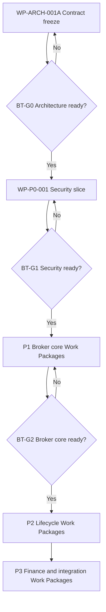
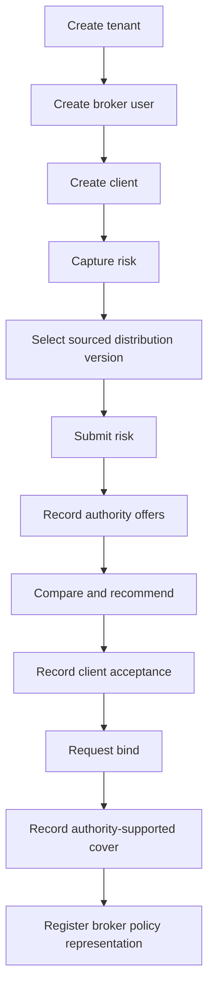

# BizTrust P0–P3 Delivery and Gate Plan

| Field | Value |
|---|---|
| Version | `0.1-draft` |
| Status | `PLANNING BASELINE — AUTHORITY REQUIRED PER WORK PACKAGE` |
| Parent | `BIZTRUST-ARCH-001` |
| Superseded in part | By [`BIZTRUST-PLAN-001.md`](BIZTRUST-PLAN-001.md) `1.0-draft` for the phase partition and the epic homes (its section 9 maps every epic here to its new home). This file remains the record the phase manuals under `phases/` render, and `tests/test_phase_pages.py` binds them to it, until tickets #165 to #170 on the Guide v2 map (#153) move each manual; section 7 is a pointer to PLAN-001 section 10 since WP-051 (#165), which the overview renders and the phase-page test reads; sections 8, 9 and 11 stand until a ticket carries them |

## 1. Naming rule

Two gate systems exist and must never be confused:

| Namespace | Purpose | Examples |
|---|---|---|
| `ENG-G0…ENG-G8` | Lifecycle gate applied to every Work Package | Discover, define, architect, plan, build, assure, release, operate, learn |
| `BT-G0…BT-G7` | BizTrust platform capability milestone | Architecture ready through production ready; the table is `BIZTRUST-PLAN-001.md` section 10 |

`P0…P3` are delivery phases, not approval states. A phase may contain many Work Packages, each moving through the `ENG-G*` lifecycle.

## 2. Controlled execution chain

Architecture acceptance authorizes only the next bounded planning step. It does not grant blanket implementation or production authority.

## 3. P0 — Architecture and platform foundation

**Objective:** freeze the contract and mechanically prove the tenant-security substrate before placing real insurance-domain data on it.

| Epic | Deliverable | Exit evidence |
|---|---|---|
| P0.1 | `BIZTRUST-ARCH-001` and ADR-001…020 | Authority record and resolved findings |
| P0.2 | Repository and module boundaries | Build, dependency and boundary tests |
| P0.3 | Logto integration spike | Token-validation evidence |
| P0.4 | Organization-to-tenant mapping | Mapping and mismatch tests |
| P0.5 | Tenant provisioning | Repeatable Tenant A and B provisioning |
| P0.6 | PostgreSQL tenancy model | Migration and ownership tests |
| P0.7 | RLS enforcement | Cross-tenant read/write/delete denial |
| P0.8 | API conventions | Linted OpenAPI baseline |
| P0.9 | Event conventions | Linted AsyncAPI/event envelope |
| P0.10 | Audit framework | Attributable denial and success evidence |
| P0.11 | Observability baseline | Logs, metrics and traces linked by request |
| P0.12 | Secrets/configuration management | Rotation and least-privilege evidence |
| P0.13 | Control-plane web surface | Tenant selection, member administration and the audit viewer exercised end to end after the independent proof, with no insurance function present |

### P0 mandatory proof

- Tenant A can access authorized Tenant A data.
- Tenant A cannot read, create, update or delete Tenant B protected data.
- Missing or invalid organization context is denied.
- Tampered URL, header, body and query tenant identifiers are denied or ignored safely.
- Wrong audience, expired token, inactive membership and absent scope are denied.
- An application-level authorization bypass test remains blocked by RLS.
- Every outcome produces tenant-safe audit evidence.

No P1 authorization may be issued until this proof passes independently.

## 4. P1 — Broker core MVP

**Objective:** deliver a manual-insurer-assisted quote-to-policy lifecycle with correct broker/insurer boundaries.

| Epic | Capability |
|---|---|
| P1.1 | Party and client account |
| P1.2 | Client 360 and relationship view |
| P1.3 | Risk profile and submission snapshot |
| P1.4 | Insurer-product provenance and immutable distribution product version |
| P1.5 | Submission lifecycle |
| P1.6 | Manual insurer/delegated offer and revisions; broker indication kept distinct |
| P1.7 | Coverage comparison |
| P1.8 | Broker recommendation and disclosures |
| P1.9 | Client acceptance evidence |
| P1.10 | Bind request and authority-supported coverage evidence |
| P1.11 | Broker policy register |
| P1.12 | Documents and audit trail |
| P1.13 | Basic broker portal |

### P1 vertical-slice acceptance

Automation of insurer APIs is not required for P1. Correct state, evidence and ownership are required.

## 5. P2 — Professional brokerage lifecycle

**Objective:** expand the core into professional placement, servicing and claims/renewal operations.

| Epic | Capability |
|---|---|
| P2.1 | Placement workspace and insurer panel |
| P2.2 | Market requests and communication evidence |
| P2.3 | Quote revision and coverage matrix |
| P2.4 | Durable binding workflow |
| P2.5 | Policy endorsement and cancellation workflow |
| P2.6 | Claims notification and broker advocacy |
| P2.7 | Renewal case and market re-engagement |
| P2.8 | Tasks, diary and SLA controls |
| P2.9 | Compliance, consent and advice file |
| P2.10 | Event infrastructure and workflow operations |

P2 exits only when delayed, duplicate and conflicting external interactions have been exercised without corrupting broker state.

## 6. P3 — Financial and integration platform

**Objective:** close the insurance-to-money-to-insurer loop with attributable, reconcilable records.

| Epic | Capability |
|---|---|
| P3.1 | Invoice and premium due |
| P3.2 | Payment intent, attempt and allocation |
| P3.3 | Payment adapter and signed webhook handling |
| P3.4 | Refund, reversal and chargeback |
| P3.5 | Immutable double-entry insurance subledger |
| P3.6 | Versioned broker and agent commission |
| P3.7 | Insurer settlement and remittance |
| P3.8 | Bank/provider/ledger reconciliation |
| P3.9 | Insurer and payment Adapter SDKs |
| P3.10 | Partner API and versioned webhooks |
| P3.11 | Tenant Pack validation foundation |

End-to-end evidence must trace customer/partner activity through indication/offer, payment, authority-supported coverage confirmation, policy representation, ledger, commission, settlement and reconciliation.

## 7. BizTrust architecture gates

The gate table is in [`BIZTRUST-PLAN-001.md`](BIZTRUST-PLAN-001.md) section 10 since WP-049: the seven rows this section held, `BT-G0` to `BT-G6`, are reproduced there verbatim, `BT-G7 Production Ready` is added, and the executive labels A to E are mapped onto the identifiers. The phase overview renders that table and `tests/test_phase_pages.py` holds it to PLAN-001 since WP-051. The rule stands: failure at any gate blocks dependent authorization, and a waiver requires a named human risk owner, expiry, compensating controls and recorded dissent.

## 8. Work Package decomposition rule

Each epic becomes one or more Work Packages containing:

- one bounded outcome and accountable owner;
- explicit in-scope and out-of-scope statements;
- dependencies and architecture contracts;
- risk classification and data classification;
- permitted tools/actions and authority expiry;
- acceptance criteria and independent verifier;
- rollback or compensation strategy;
- evidence manifest requirements;
- checkpoint cadence and one next safe action.

Never open all P0–P3 epics as simultaneously active. Maintain one primary next action and a dependency-ordered queue.

## 9. Recommended immediate backlog

| Order | Work Package | Outcome | Start condition |
|---:|---|---|---|
| 1 | `BIZTRUST-WP-ARCH-001A / ARCH-001A-S01` | Establish tenant authority, jurisdiction and money-regime inputs | Human sponsor confirms reviewers and evidence access |
| 2 | `BIZTRUST-WP-ARCH-001A / S02–S11` | Complete the remaining architecture decisions one accepted slice at a time | Previous slice accepted; see `FOUNDATION_SEQUENCE.md` |
| 3 | `BIZTRUST-WP-P0-001` | Prove the tenant-security vertical slice | `BT-G0` passes |
| 4 | `BIZTRUST-WP-P1-001` | Establish client/risk/distribution-product/submission skeleton | `BT-G1` passes |
| 5 | `BIZTRUST-WP-P1-002` | Complete indication/offer comparison/recommendation | P1-001 evidence accepted |
| 6 | `BIZTRUST-WP-P1-003` | Complete acceptance/authority-supported cover/policy representation | P1-002 evidence accepted |

## 10. Post-P3 horizon

Claims/renewal depth, partner scale, additional isolation tiers, analytics and AI assistance may expand after P3, but they remain uncommitted roadmap candidates until business value, risk, dependencies and authority are defined. They must not be labeled P4–P9 in the current baseline because that would imply a sequencing commitment that has not been reviewed.

## 11. Exit from planning

Planning is ready for implementation only when:

- the parent architecture and applicable ADRs are accepted;
- the Work Package has explicit implementation authority;
- dependencies and owner boundaries are resolvable;
- test environments and evidence storage exist;
- failure containment and rollback are rehearsable;
- security, domain and jurisdiction-dependent reviews are assigned;
- the repository checkpoint identifies exactly one next safe action.
