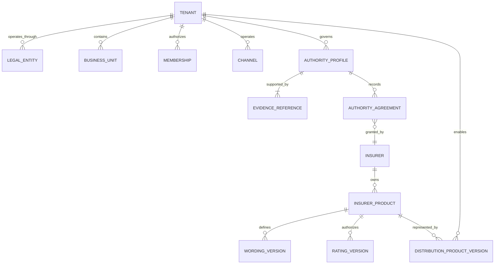
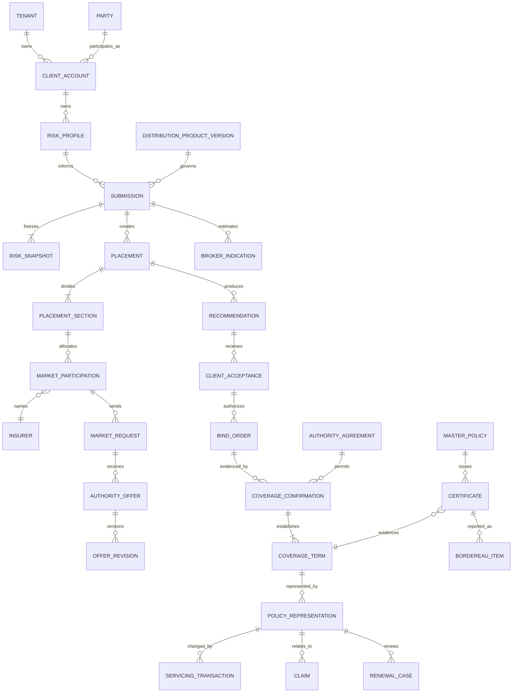
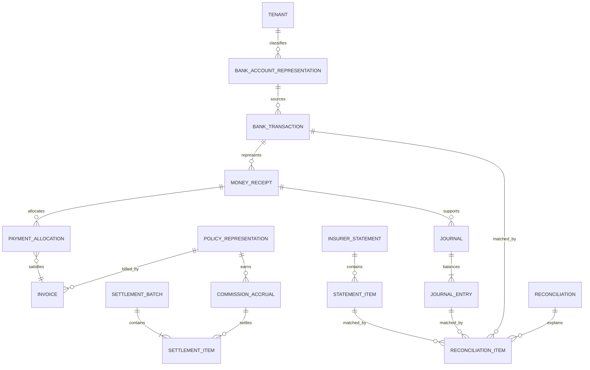

# BizTrust Conceptual Domain Model

| Field | Value |
|---|---|
| Version | `0.1-draft` |
| Status | `DRAFT FOR DOMAIN REVIEW` |
| Parent | `BIZTRUST-ARCH-001` |
| Target child contract | `BIZTRUST-DOMAIN-001` and `BIZTRUST-DATA-001` |

This is a conceptual model. It defines identity, ownership and cardinality questions that implementation must resolve; it does not prescribe table names, columns or service boundaries.

## 1. Artifact hierarchy

| Artifact | Authority | Purpose |
|---|---|---|
| `BIZTRUST-ARCH-001` | Parent | Platform architecture and invariants |
| `BIZTRUST-AUTHORITY-001` | Prerequisite | Tenant legal entity, contract authority, product authority, jurisdiction and money-regime profiles |
| `BIZTRUST-DOMAIN-001` | Child | Ubiquitous language, bounded contexts and aggregate contracts |
| `BIZTRUST-DATA-001` | Child | Canonical entities, ownership, tenancy and lifecycle |
| `BIZTRUST-IAM-001` | Child | Identity mapping, authorization and approval policy |
| `BIZTRUST-API-001` | Child | HTTP resources and OpenAPI rules |
| `BIZTRUST-EVENT-001` | Child | Event semantics, envelope and compatibility |
| `BIZTRUST-WF-001` | Child | State machines and durable processes |
| `BIZTRUST-FIN-001` | Child | Billing, payment, ledger, commission and settlement |
| `BIZTRUST-INT-001` | Child | Insurer, payment, bank and partner adapters |
| `BIZTRUST-PLAN-001` | Child | P0–P3 delivery decomposition |

Child artifacts elaborate the parent and cannot silently contradict an accepted parent invariant or ADR.

## 2. Conceptual ERDs

The model is split by concern so that tenant access, insurance authority and money custody are not collapsed into one relationship. Cardinalities are candidates for S08 review.

### 2.1 Tenant, authority and product provenance



`AUTHORITY_PROFILE` is an accepted conclusion about an operating arrangement; `AUTHORITY_AGREEMENT` identifies the operative source. Neither contains unrestricted private agreement text in the public architecture repository.

### 2.2 Risk, placement and effective cover



`PLACEMENT_SECTION` can represent a coverage section or layer; `MARKET_PARTICIPATION` records an insurer share, attachment/exhaustion information where applicable, and participation status. A simple single-insurer placement is one section with one participation, not a different model.

### 2.3 Money, ledger and reconciliation



The approved client-money regime determines account classes, posting constraints and which balances may interact. This diagram deliberately does not assume that premium in a broker-controlled bank account is broker-owned money.

## 3. Core concept definitions

| Concept | Candidate definition | Key invariant |
|---|---|---|
| Tenant | Independent BizTrust business and security context | One authoritative tenant owner for protected records |
| Legal Entity | Licensed company operating inside or as a tenant | Regulatory identity is explicit, not inferred from tenant name |
| Authority Profile | Accepted, tenant/arrangement-specific conclusion about licence, contract, product and money authority | Effective, reviewed and supported by controlled evidence references |
| Authority Agreement | Reference to the insurer, scheme or other operative agreement granting or limiting an act | Scope, period, limit, territory and referral rules remain explicit |
| Party | Person or organization independent of its broker relationship | Party data does not silently become a client account |
| Client Account | Tenant-specific broker-client relationship | Belongs to one tenant and references parties |
| Risk Profile | Current understanding of insurable exposure | Submission uses a reproducible snapshot |
| Insurer Product | Insurer-authoritative product, wording and rating source | Provenance and source versions are retained |
| Distribution Product Version | Published immutable BizTrust configuration for distributing a sourced product | Cannot claim insurer authority that its source does not grant |
| Submission | Broker/customer request for terms | Submitted content is attributable and versioned |
| Placement | Broker process of engaging one or more markets | Owns market requests, not insurer underwriting |
| Broker Indication | Broker-calculated estimate that is not an insurer offer unless authority proves otherwise | Labeled and stored separately from authoritative offers |
| Offer Revision | Immutable insurer or delegated-authority terms received/created at a point in time | Authority, validity and prior revision are explicit; presented terms are never overwritten |
| Recommendation | Broker-authored comparison/advice | Distinct from a quote and retains disclosures |
| Client Acceptance | Evidence of client selection and authority | Does not itself confirm coverage |
| Bind Order | Broker/client instruction to request or exercise defined authority | Request and authoritative confirmation remain separate |
| Coverage Confirmation | Evidence-backed assertion that cover is effective under an accepted authority agreement | Carries authority, effective period, record time and evidence |
| Coverage Term | Effective cover for one section/share/layer or certificate scope | May not exist without valid confirmation evidence |
| Policy Representation | Broker representation of insurer-issued or authority-supported cover | Never impersonates the authoritative source document |
| Claim | Broker advocacy and coordination record | Insurer adjudication is sourced separately |
| Money Receipt | Confirmed external money movement represented operationally | Separate from custody/risk class, allocation and journal state |
| Client-money classification | Accepted legal/contract conclusion about funds held or in transit | Must not be inferred from bank-account ownership alone |
| Journal | Balanced accounting transaction | Immutable after posting |
| Commission Accrual | Versioned economic entitlement | Historical rule and basis retained |
| Settlement Batch | Controlled grouping of payable/receivable items | Completion requires reconciliation evidence |

## 4. Aggregate ownership rules

- An aggregate has exactly one owning module.
- Only the owner executes its commands and persists its invariant-bearing state.
- Other modules reference stable identifiers or consume versioned facts.
- A workflow coordinates commands; it does not bypass aggregate ownership.
- External source references are immutable evidence, not ownership transfer.
- Tenant ownership and legal-entity ownership are explicit where both matter.
- Deletion, retention and anonymization operate through approved lifecycle rules; they are not ad-hoc table operations.

## 5. Snapshot and version rules

The following must be reproducible from retained identifiers and evidence:

| Business fact | Minimum version/snapshot references |
|---|---|
| Submitted risk | Risk snapshot, questionnaire schema and submission revision |
| Broker indication | Distribution/rating version, calculation inputs, authority classification and non-binding label |
| Insurer/delegated offer | Authority source, payload digest, offer revision, normalization version and validity |
| Recommendation | Offer/indication revisions compared, coverage matrix version, disclosure and advice version |
| Client acceptance | Recommendation version, accepted offer revision, actor and evidence |
| Bind request | Acceptance, authority profile, distribution/source product versions, terms, actor, idempotency key and request reference |
| Coverage confirmation | Authority agreement/profile, source identity, evidence digest, effective period, record time and supersession |
| Policy registration | Coverage confirmation, insurer/master-policy/certificate references, product/wording/rating versions and document digest |
| Commission accrual | Agreement/rule version, basis, effective date and source transaction |
| Journal posting | Posting-rule version, source transaction and balanced lines |

## 6. Tenant-owned record baseline

Each tenant-owned aggregate should carry or derive, through a mechanically enforced relation:

```text
tenant_id
legal_entity_id when applicable
aggregate_id
aggregate_version
effective_from and effective_to when the fact has valid-time effect
effective_timezone
recorded_at
supersedes_id when corrected
created_at
created_by
updated_at
updated_by
```

Whether `tenant_id` is physically repeated on every child row is a `BIZTRUST-DATA-001` decision. The isolation invariant applies regardless of physical normalization.

## 7. Data-review questions

- Can one party be represented in multiple tenants without cross-tenant disclosure?
- When is party data shared, copied, linked or independently mastered?
- Which risk changes invalidate an in-progress submission or quote?
- What evidence freezes a recommendation and client acceptance?
- Which accepted authority profile governs each offer, bind and coverage confirmation?
- Can one bind order result in multiple coverage terms, insurer shares, layers, policies or certificates?
- How do master-policy declarations, bordereaux and account-current reporting map to certificates and settlements?
- How are insurer corrections and policy-document supersession represented?
- How are valid time and record time queried for backdated, future-dated and corrected facts?
- Which financial dimensions belong to custody/risk class, receipt, invoice, allocation, journal and settlement?
- Which reconciliations compare bank, client-money ledger, insurer statement and commission evidence?
- Which documents contain regulated or highly sensitive data?
- What retention or erasure rules conflict with immutable financial/audit obligations?
- Which identifiers may be exposed to partners versus internal-only?

These questions block physical schema freeze when unanswered.
