# BizTrust Canonical Flows

| Field | Value |
|---|---|
| Version | `0.1-draft` |
| Status | `DRAFT FOR CONTRACT FREEZE` |
| Parent | `BIZTRUST-ARCH-001` |
| Rule | A diagram explains a contract; it does not prove implementation |

This document defines the candidate end-to-end flows and state ownership that agents must use when decomposing Work Packages. Every transition requires a named command owner, authorization rule, invariant check, audit record and test.

## 1. Canonical brokerage lifecycle

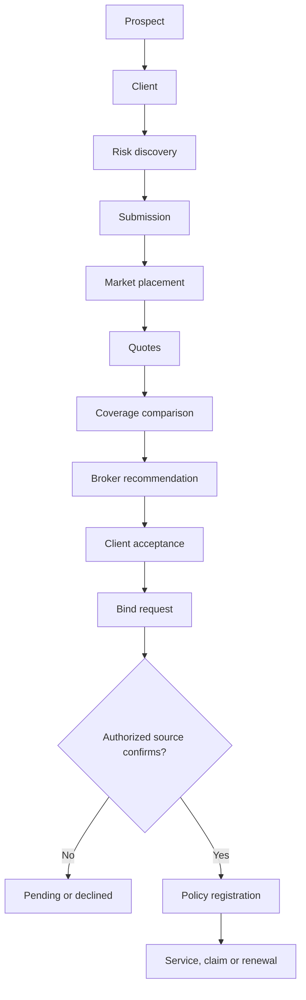

Critical semantic boundary:

> A bind request records an instruction to seek or exercise authority for cover. BizTrust may represent coverage as confirmed only from retained evidence produced by the authority holder for that tenant/product arrangement—normally the insurer, or a documented delegated/master-policy authority accepted under ADR-013.

The flow is broker-native. A high-volume digital product may automate parts of it, but automation cannot remove the authority, effective-period, evidence or owning-module checks. An application role does not itself grant authority to conclude insurance contracts.

## 2. Straight-through digital variant

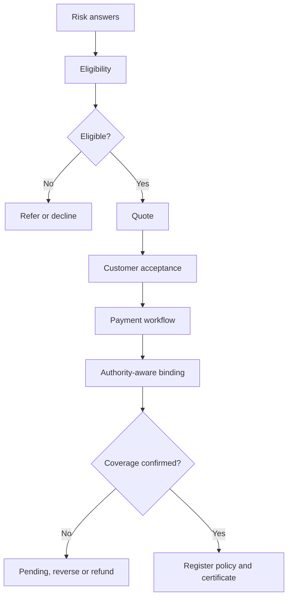

Straight-through processing is a workflow configuration, not a separate product-specific application. Referral, timeout, decline and compensation are first-class outcomes.

## 3. Tenant authorization sequence

```mermaid
sequenceDiagram
    actor Actor as User or service
    participant IAM as Logto
    participant Edge as APISIX
    participant API as BizTrust API
    participant Authz as Business authorization
    participant DB as PostgreSQL RLS
    participant Audit as Audit evidence

    Actor->>IAM: Request API token with organization context
    IAM-->>Actor: Signed token with audience, organization and scopes
    Actor->>Edge: Protected request
    Edge->>API: Validated edge request
    API->>API: Verify signature, issuer, audience and expiry
    API->>Authz: Resolve tenant, membership, scope and authority
    alt Context or authority invalid
        Authz-->>Audit: Record denied decision
        API-->>Actor: Deny with problem details
    else Context authorized
        API->>DB: Set trusted tenant context and execute command
        alt RLS denies
            DB-->>Audit: Record isolation denial
            API-->>Actor: Deny without cross-tenant disclosure
        else RLS allows
            DB-->>API: Tenant-owned result
            API-->>Audit: Record action and outcome
            API-->>Actor: Return response
        end
    end
```

The API must not copy an untrusted `X-Tenant-ID` directly into a database session variable. The authenticated organization, BizTrust tenant mapping and requested resource scope must be reconciled first.

### Minimum negative proof matrix

| Attempt | API expectation | Database expectation | Audit expectation |
|---|---|---|---|
| Missing token | Deny | No business query | Authentication failure recorded |
| Expired or malformed token | Deny | No business query | Safe reason code recorded |
| Wrong audience | Deny | No business query | Audience failure recorded |
| Missing organization context | Deny protected tenant route | No tenant query | Context failure recorded |
| Inactive membership | Deny | No mutation | Membership result recorded |
| Tenant A requests Tenant B URL | Deny | No Tenant B rows | Mismatch recorded without data leakage |
| Tenant A injects Tenant B body/header ID | Deny or ignore untrusted value | `WITH CHECK` prevents write | Tampering outcome recorded |
| Application check is bypassed in a test path | Request cannot expose Tenant B | RLS denies | Database denial linked to test |

## 4. Module contract map

| Owner module | Representative commands | Representative queries | Facts published |
|---|---|---|---|
| Tenancy | `CreateTenant`, `AddMember`, `DisableTenant` | `GetTenant`, `ListMemberships` | `TenantCreated`, `MembershipChanged` |
| Client | `CreateClient`, `UpdateClient` | `GetClient360` | `ClientCreated`, `ClientUpdated` |
| Risk | `CreateRisk`, `ReviseRisk` | `GetRiskProfile` | `RiskUpdated`, `RiskSnapshotCreated` |
| Distribution Product | `PublishDistributionVersion`, `RetireDistributionVersion` | `GetDistributionVersion` | `DistributionVersionPublished` |
| Submission | `CreateSubmission`, `SubmitRisk`, `WithdrawSubmission` | `GetSubmission` | `SubmissionSubmitted`, `SubmissionWithdrawn` |
| Placement | `OpenPlacement`, `CloseMarket` | `GetPlacement` | `PlacementOpened`, `MarketClosed` |
| Quote / Indication | `RecordIndication`, `RecordAuthorityOffer`, `ValidateOffer`, `PresentOffer` | `CompareOffers`, `GetOffer` | `IndicationCalculated`, `AuthorityOfferReceived`, `OfferPresented` |
| Recommendation | `IssueRecommendation`, `RecordAcceptance` | `GetRecommendation` | `RecommendationIssued`, `RecommendationAccepted` |
| Binding | `RequestBind`, `ResolveAuthority`, `RecordCoverageConfirmation` | `GetBindStatus` | `BindRequested`, `CoverageConfirmed`, `BindDeclined` |
| Policy | `RegisterPolicy`, `RecordEndorsement` | `GetPolicy` | `PolicyRegistered`, `PolicyCoverageChanged` |
| Claims | `NotifyClaim`, `RecordInsurerUpdate`, `CloseClaim` | `GetClaim` | `ClaimNotified`, `ClaimSubmittedToInsurer` |
| Renewal | `StartRenewal`, `CompleteRenewal` | `GetRenewal` | `RenewalStarted`, `RenewalCompleted` |
| Payment | `CreatePaymentIntent`, `ConfirmProviderPayment`, `RequestRefund` | `GetPayment` | `PaymentConfirmed`, `RefundConfirmed` |
| Ledger | `PostJournal`, `ReverseJournal` | `GetBalance`, `GetJournal` | `JournalPosted`, `JournalReversed` |
| Commission | `AccrueCommission`, `ReverseCommission` | `GetCommission` | `CommissionAccrued`, `CommissionReversed` |
| Settlement | `CreateSettlement`, `CompleteSettlement` | `GetSettlement` | `SettlementCompleted` |

Names are candidate contract language. The domain specification must define command preconditions, payload schemas, authorization, idempotency scope and resulting events before implementation.

## 5. State-machine contract template

Every state transition specification must include:

| Field | Required content |
|---|---|
| Current state | Explicit source state or states |
| Command | One owning command |
| Actor | Human or service role |
| Preconditions | Business, authorization and evidence checks |
| Resulting state | One deterministic result per outcome |
| Side effects | Owned writes only; cross-module work through contracts |
| Event | Completed fact with version and tenant context |
| Idempotency | Scope, key and replay response |
| Concurrency | Expected version / `If-Match` behavior |
| Audit | Actor, authority, prior state, outcome and evidence |
| Compensation | Safe recovery when downstream work fails |
| Tests | Happy path, prohibited transition, retry and race cases |

## 6. Submission state

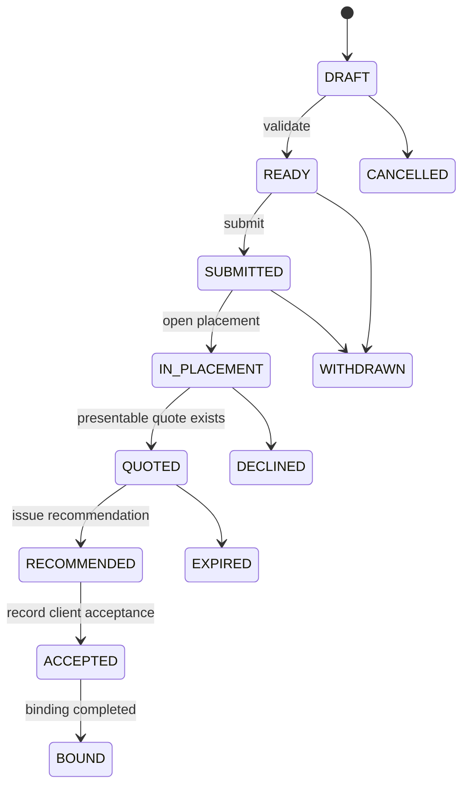

`BOUND` is entered only from an accepted, authority-supported binding outcome with an effective period; it cannot be inferred from payment or a sent bind request.

## 7. Placement state

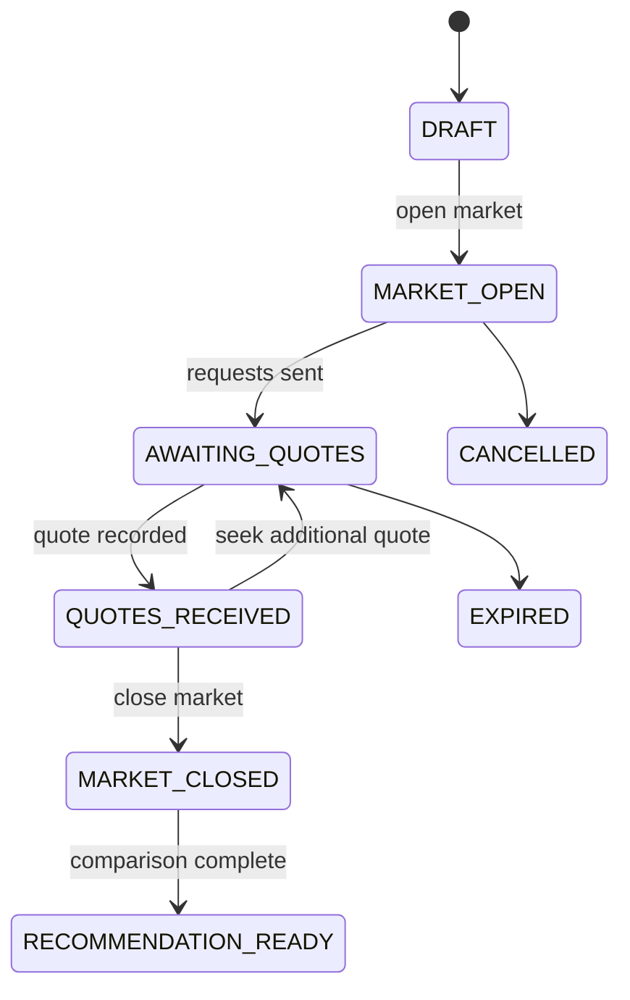

A placement can involve multiple market requests. Insurer-specific states belong to each market request; the placement summarizes the broker process.

## 8. Quote state and revisions

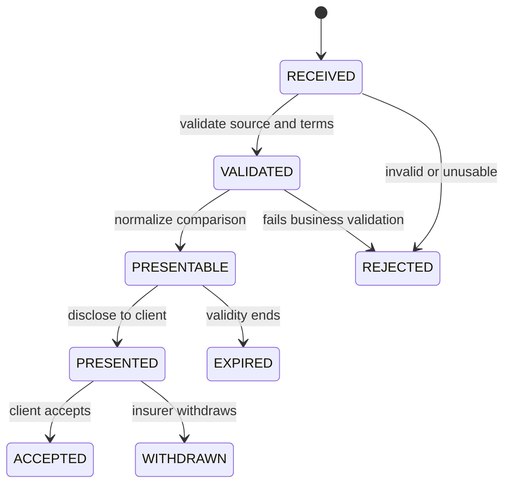

A revised insurer/delegated offer creates an immutable `QuoteRevision` linked to the prior revision. It does not overwrite terms already presented or accepted. A broker-calculated `Indication` is a different type and cannot enter the insurer/delegated-offer state machine unless an accepted authority profile proves that the calculation creates an authoritative offer.

## 9. Binding state

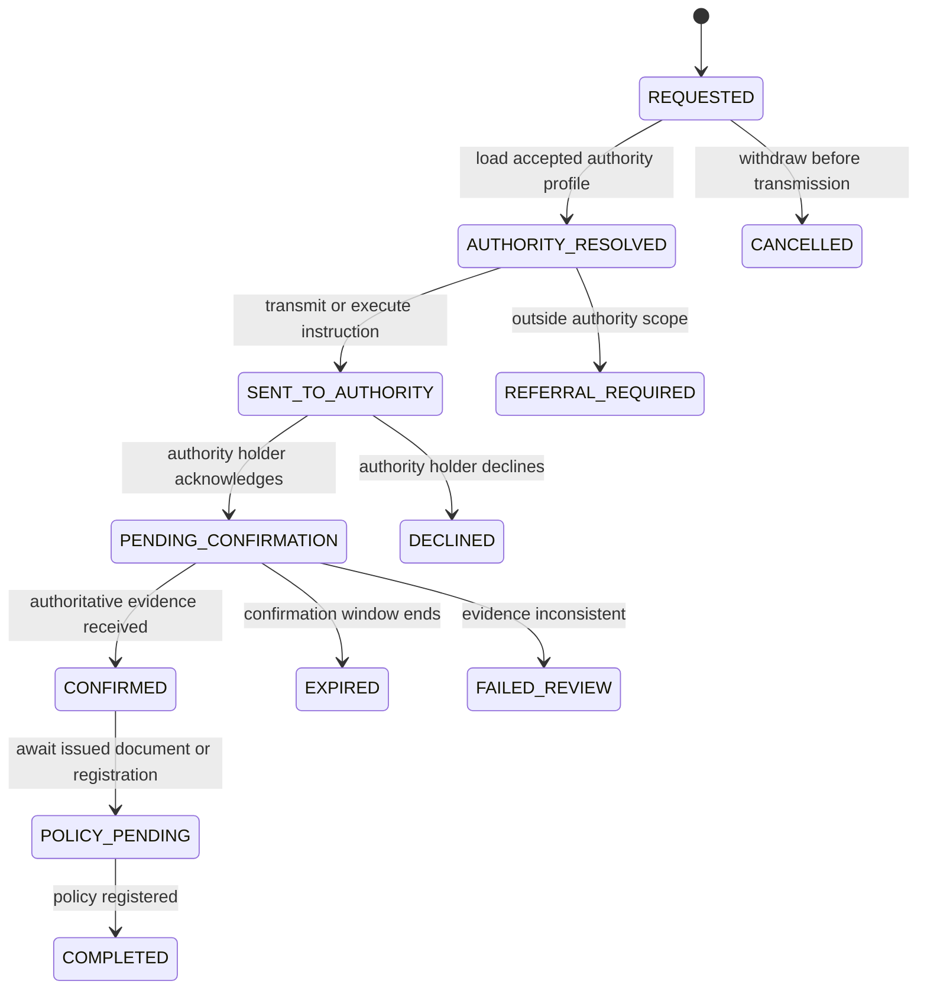

### Binding safety rules

- `REQUESTED`, `AUTHORITY_RESOLVED`, `SENT_TO_AUTHORITY`, `REFERRAL_REQUIRED` and `PENDING_CONFIRMATION` do not mean insured.
- `CONFIRMED` requires the accepted authority-agreement/profile reference, source identity, effective start/end, recorded time and retained evidence.
- When the arrangement is `REQUEST_ONLY`, only insurer-authoritative evidence can confirm cover.
- When delegated or master-policy authority exists, the command must prove product, territory, limit, period and referral constraints before confirmation.
- User permission to execute `RecordCoverageConfirmation` does not replace the business/legal authority check.
- Duplicate confirmation callbacks must be idempotent.
- Conflicting confirmations enter manual review; the latest message does not silently win.
- Policy registration must reference the completed bind order, coverage evidence and sourced product/wording versions.

## 10. Policy status dimensions

A policy must not compress all concerns into one overloaded status. Track at least:

| Dimension | Candidate values | Owner/source |
|---|---|---|
| Coverage | `PENDING`, `ACTIVE`, `EXPIRED`, `CANCELLED` | Policy, based on accepted authority evidence and valid time |
| Authority confirmation | `NOT_REQUESTED`, `PENDING`, `CONFIRMED`, `DECLINED`, `DISPUTED` | Binding / insurer or delegated-authority evidence |
| Document | `PENDING`, `RECEIVED`, `VALIDATED`, `SUPERSEDED` | Policy / Document |
| Premium | `NOT_DUE`, `DUE`, `PARTIALLY_PAID`, `PAID`, `REFUND_PENDING`, `REFUNDED` | Billing / Payment projection |
| Servicing | `NORMAL`, `ENDORSEMENT_PENDING`, `CANCELLATION_PENDING`, `RENEWAL_PENDING` | Policy workflow |

Coverage transitions are owned by the Policy module and require evidence from the authority defined in the accepted tenant profile. Payment status may be a precondition but cannot directly mutate coverage.

### 10A. Effective time and record time

Every coverage-sensitive fact must distinguish when it is true in the business domain from when BizTrust learned or recorded it.

| Temporal field | Meaning |
|---|---|
| `effective_from` | Start of the fact's valid business period |
| `effective_to` | End of the valid period, when known |
| `effective_timezone` | Timezone/basis used by the authoritative source |
| `source_created_at` | Time shown by the source evidence, when supplied |
| `source_received_at` | Time BizTrust received the source evidence |
| `recorded_at` | Time the immutable BizTrust assertion was committed |
| `supersedes_id` | Prior assertion corrected or replaced by this assertion |

A backdated confirmation recorded today can have an earlier `effective_from` without pretending it was known yesterday. A correction creates a new assertion; it does not rewrite the original receipt or audit history. `ADR-015` must define as-of queries, interval overlap rules, precision and open-ended periods before schema freeze.

## 11. Claims flow

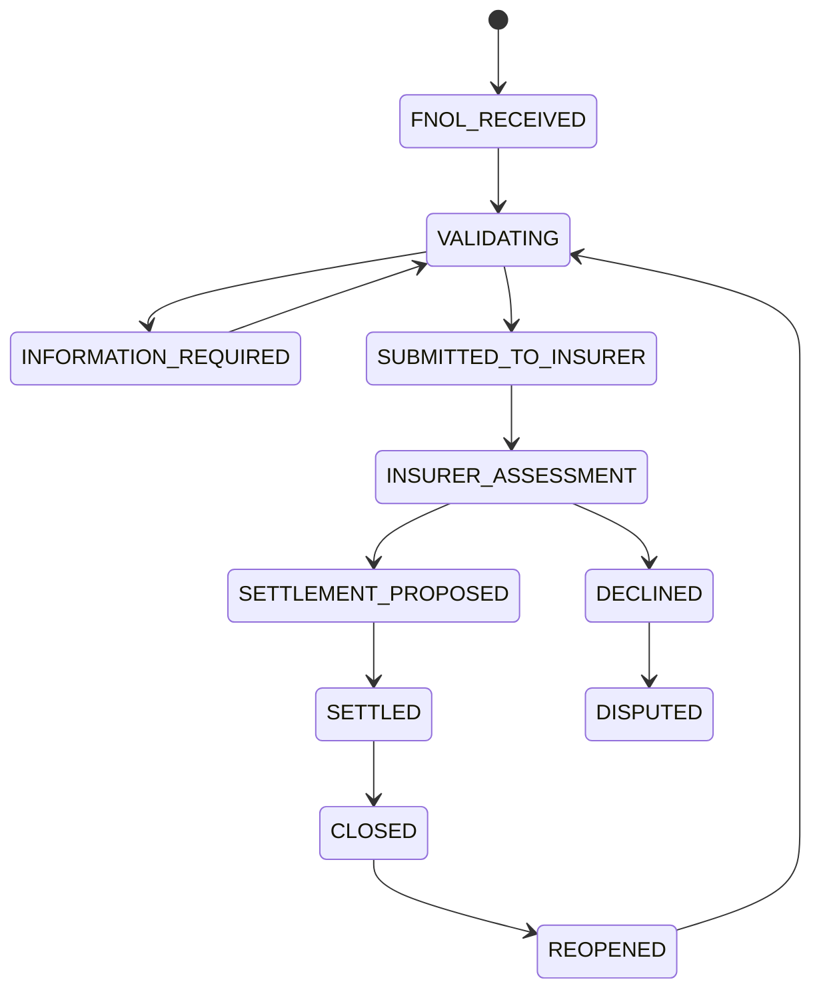

BizTrust stores both `broker_claim_status` and a sourced `insurer_claim_status`. Broker status describes advocacy and coordination; it must not rewrite or simulate insurer adjudication.

## 12. Payment state

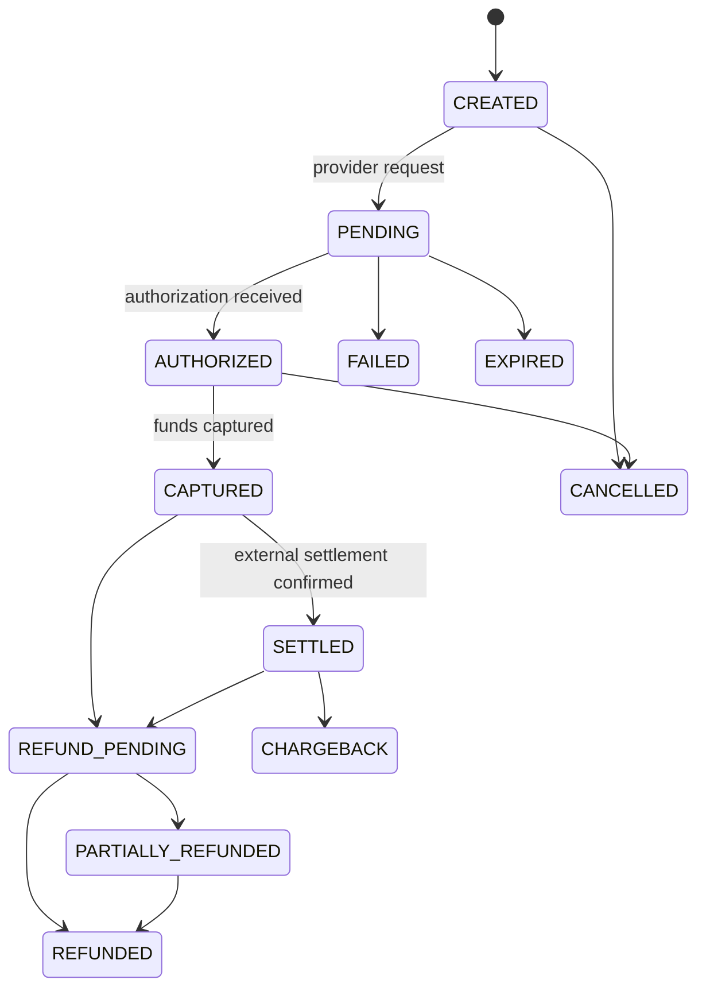

Provider state, BizTrust operational state, allocation state and ledger state remain separately attributable.

### 12A. Client-money and reconciliation dimensions

The payment lifecycle above does not answer who owns or bears risk for the funds. Track separate dimensions under the regime accepted in `ADR-014`:

| Dimension | Examples | Authority/source |
|---|---|---|
| External movement | initiated, authorized, captured, cleared, reversed | Bank or PSP |
| Custody/risk class | client risk, insurer risk, office money, other approved class | Governing law and operative agreement |
| Allocation | unallocated, partially allocated, fully allocated, reallocated | Payment/ledger rules |
| Insurer remittance | not due, due, submitted, confirmed, disputed | Settlement plus insurer evidence |
| Commission | unearned, earned, accrued, received, paid, clawed back | Commission agreement/rule version |
| Reconciliation | matched, timing difference, unexplained difference, resolved | Reconciliation owner and evidence |

At least three reconciliation controls must be specified separately: bank versus client-money ledger, client-money ledger versus insurer statement/account-current, and commission earned versus commission received. Telemetry may report a breach; invariant checks prevent or block invalid transitions.

## 13. Payment-to-policy safety workflow

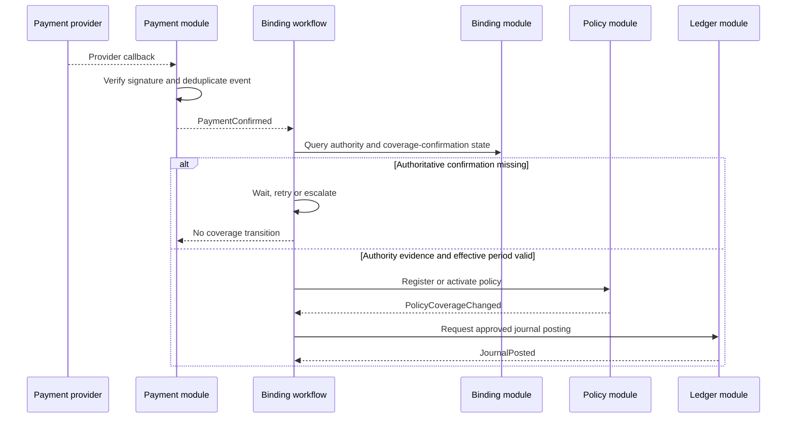

The workflow coordinates modules but cannot mutate their tables. If payment succeeds and binding fails, an approved compensation policy determines hold, void or refund; the workflow does not invent a financial outcome.

## 14. Journal and commission flow

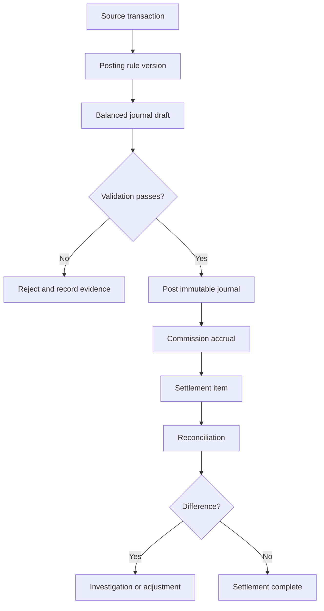

All example accounting entries are conceptual until jurisdiction and accounting review approve a chart of accounts and posting rules.

## 15. Event publication and consumption

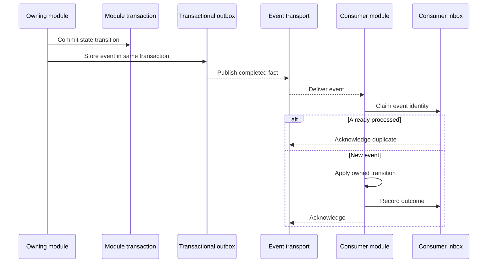

The outbox/inbox pattern is a `PROPOSED_DECISION`, not a guarantee of exactly-once execution. Business idempotency and reconciliation remain mandatory.

## 16. Failure classification

| Failure | Owning response | Prohibited shortcut |
|---|---|---|
| Provider timeout | Retry with bounded policy; preserve pending state | Assume success |
| Duplicate callback | Return prior idempotent result | Repeat financial or binding mutation |
| Conflicting insurer messages | Quarantine and require review | Last-write-wins coverage |
| Event transport unavailable | Retain outbox and alert on backlog | Drop completed facts |
| Consumer unavailable | Redeliver and monitor age | Directly edit consumer tables |
| Ledger imbalance | Reject the posting atomically | Post a partial journal |
| Tenant context mismatch | Deny before domain execution | Trust request tenant ID |
| Stale aggregate version | Reject or retry from fresh state | Overwrite concurrent change |
| Workflow code upgrade | Version workflow behavior and test replay | Break in-flight cases |

## 17. Flow conformance evidence

Before a flow is accepted, attach:

- a transition table and machine-readable state definition;
- OpenAPI command and query contracts;
- AsyncAPI event contracts;
- authorization matrix entries;
- positive, negative, retry and concurrency tests;
- audit-event examples with sensitive fields redacted;
- failure-injection results;
- trace showing correlation and causation across modules;
- independent domain and security review;
- source revision, toolchain and environment identifiers.
