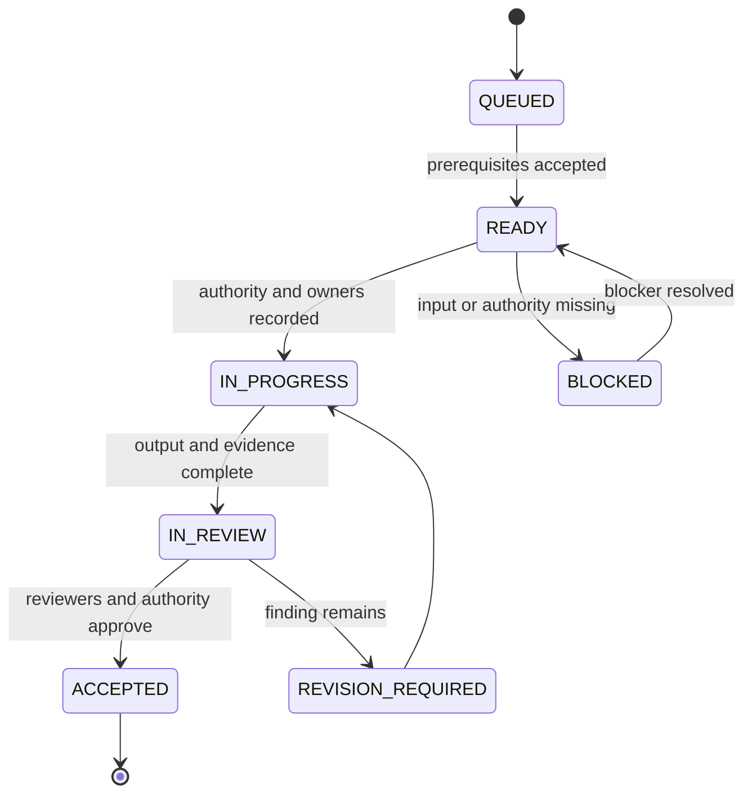

# BizTrust Architecture Foundation — One-by-One Sequence

| Field | Value |
|---|---|
| Program | [`BIZTRUST-WP-ARCH-001A`](https://github.com/bstBizEra/biztrust_guide/issues/27) |
| Target artifact | `BIZTRUST-ARCH-001 v0.1` |
| Status | `PROPOSED SEQUENCE — NO IMPLEMENTATION AUTHORITY` |
| Blocking finding | [Issue #15](https://github.com/bstBizEra/biztrust_guide/issues/15) |
| Research ledger | [`report-source.md`](../research/architecture-foundation/report-source.md) |

The architecture is completed as an ordered series of decision slices. The table is the queue; GitHub Issues are the controlled execution records. A future slice is not opened merely to make the board look complete.

## 1. Control rule

At any time:

- one parent contract-freeze issue may remain open;
- no more than one architecture slice is labeled `state:in-progress`;
- every active slice has one bounded decision outcome;
- its prerequisites are accepted or explicitly waived by the correct risk owner;
- its evidence and dissent are attached before it closes; and
- closing it names exactly one next slice that may be created.

GitHub's native **parent/sub-issue** and **blocked-by/blocking** relationships should encode the graph. Markdown links are useful context but are not a substitute for native dependencies. If the repository cannot create those relationships programmatically, a maintainer sets them in the issue's **Relationships** panel before work starts.

## 2. State model

`ACCEPTED` means the design slice and its evidence were accepted. It does not mean the production capability exists.

## 3. Ordered foundation slices

| Order | Slice ID | Decision outcome | Blocking input | Required output | Exit gate |
|---:|---|---|---|---|---|
| 01 | `ARCH-001A-S01` | Tenant authority, jurisdiction and money-regime input contract | Business principals, operative agreements, qualified insurance/legal/finance review | Tenant authority profiles and evidence register | Every unknown is answered or explicitly blocks dependent design |
| 02 | `ARCH-001A-S02` | Canonical glossary, actors and legal/business authority model | S01 | Domain glossary, actor map, authority taxonomy | Terms distinguish permission, delegated authority and system of record |
| 03 | `ARCH-001A-S03` | Broker/insurer/provider systems of record and provenance | S01–S02 | Ownership matrix and evidence hierarchy | Every authoritative datum and representation has one owner and source |
| 04 | `ARCH-001A-S04` | Coverage, contract and temporal model | S01–S03 | Effective/record-time rules; bind/confirm/issue state machines | Backdated, future-dated and corrected evidence can be represented without overwriting history |
| 05 | `ARCH-001A-S05` | Placement and contract topology | S01–S04 | Co-insurance, layer, facility, master-policy, certificate and bordereau model | Single- and multi-market scenarios fit one explicit model |
| 06 | `ARCH-001A-S06` | Client money, premium, commission and reconciliation model | S01, S03–S05 | Funds-flow model, account taxonomy, posting/earning/refund rules | Money ownership, allocations and three reconciliation classes are testable |
| 07 | `ARCH-001A-S07` | Tenancy, identity, authorization and data-isolation contract | S01–S03 | Tenant hierarchy, Logto mapping, business authorization and RLS proof contract | Tenant authority and insurance authority remain distinct; isolation tests specified |
| 08 | `ARCH-001A-S08` | Conceptual data and module ownership contract | S02–S07 | Conceptual ERD, aggregate boundaries, retention and version rules | No critical storage-shape question remains implicit |
| 09 | `ARCH-001A-S09` | HTTP, event and integration contracts | S03–S08 | OpenAPI/AsyncAPI conventions, event envelope, adapters and compatibility policy | Contracts encode authority, provenance, idempotency and versioning |
| 10 | `ARCH-001A-S10` | Durable workflows, audit, observability and resilience | S04–S09 | Workflow catalog, failure/compensation rules, evidence model, SLO/RTO/RPO proposals | Restart, delay, duplicate, conflict and recovery cases have owners and tests |
| 11 | `ARCH-001A-S11` | Architecture conformance and contract freeze | S01–S10 | Resolved ADRs, invariant suite, review record and `BT-G0` decision | Architecture authority accepts, rejects or conditionally accepts the version |

P0 implementation is not slice 12. It is a separate Work Package that can be authorized only after `ARCH-001A-S11` passes `BT-G0`.

## 4. Slice 01 — start here

### Objective

Produce a verified input contract for each initial tenant/product arrangement so later agents do not invent the legal or commercial operating model.

### Questions that require attributable answers

#### Entity and licence

- Which legal entity is the licensed broker, agency, scheme operator or other intermediary?
- Which legal entity signs customer, insurer, bank and government agreements?
- Which jurisdictions and lines of business are in scope?
- Which licences, approvals and restrictions govern each activity?

#### Contract conclusion and cover

- Does the entity only transmit a bind request to an insurer?
- Can it conclude an insurance contract under delegated or binding authority?
- Can it issue certificates under a master policy or facility?
- What agreement, limit, territory, product, period and referral rule defines that authority?
- What evidence makes cover effective, and what effective date/time/timezone applies?

#### Product and market authority

- Who authors and approves the product, wording, rates, eligibility and underwriting rules?
- When BizTrust calculates a price, is it an indication, an insurer quote or an offer under delegated authority?
- Can one risk be split by share or layer across insurers?
- Are bordereaux, account-current or delegated-authority reports required?

#### Money and accounting

- Does the intermediary receive premium, claims money or refunds?
- While funds are in transit, are they at client risk, insurer risk or another legally defined status?
- Are client and office funds separated? Which bank accounts and currencies apply?
- When may commission be earned, deducted, clawed back or settled?
- What premium-warranty or non-payment terms can affect cover?
- What bank, client-money, insurer-statement and commission reconciliations are required?

#### Information and operations

- Where may identity, policy, claim, payment, document and audit data reside?
- What retention, legal-hold, erasure, localization and disclosure rules apply?
- Which languages, currencies, business calendars and timezone rules apply?
- Which insurer, bank, government and partner interfaces are mandatory?

### Required reviewers

| Review seat | Qualification | Decision responsibility |
|---|---|---|
| Business authority | UniTrust/BizTrust principal with authority over the operating model | Confirms intended tenant and commercial arrangement |
| Insurance domain | Practitioner with recent insurance placement experience | Confirms brokerage, authority and lifecycle semantics |
| Legal/compliance | Qualified reviewer for each operating jurisdiction | Confirms governing law, licence, delegated authority, client money and data obligations |
| Finance/accounting | Reviewer competent in broker money, commission and settlement | Confirms money-regime and accounting inputs |
| Architecture | Accountable architecture owner | Accepts the input pack as sufficient for downstream design; does not substitute for other reviewers |

An engineer or agent may prepare the pack. It may not occupy all five review seats or infer an absent answer.

### Evidence handling

Do not commit private agreements, identity records, bank details, customer data or legal advice to this public repository. Record:

- a stable document identifier;
- title, issuer/parties and effective period at the minimum disclosure level approved by counsel;
- secure source location accessible to authorized reviewers;
- SHA-256 digest where permitted;
- reviewed clauses or subject areas without copying restricted text;
- reviewer, review date and conclusion;
- unresolved qualification, expiry and revalidation date.

### Slice 01 acceptance criteria

- [ ] One profile exists for every initial tenant/product arrangement.
- [ ] Each profile identifies the acting legal entity and applicable jurisdiction.
- [ ] Contract-conclusion authority is answered `REQUEST_ONLY`, `DELEGATED_AUTHORITY`, `MASTER_POLICY_CERTIFICATE`, another defined value, or `UNKNOWN_BLOCKING`.
- [ ] Product, wording, rating and quote authority are separately identified.
- [ ] Client-money/risk-transfer treatment is answered or marked `UNKNOWN_BLOCKING` by qualified review.
- [ ] Effective-date, correction and evidence requirements are identified.
- [ ] Co-insurance, layers, facilities, certificates, bordereaux and account-current obligations are answered.
- [ ] Data location, retention and disclosure constraints are answered or block dependent work.
- [ ] Evidence references are attributable and private material remains outside the public repository.
- [ ] All five review seats record `ACCEPT`, `REVISION_REQUIRED` or `NOT_APPLICABLE` with rationale.
- [ ] Closure names `ARCH-001A-S02` as the sole next slice; no later slice is activated early.

### Stop conditions

Stop S01 and mark it `BLOCKED` when:

- an agent is being asked to infer contract authority from a product name or workflow;
- a third-party summary is the only evidence for a legal conclusion;
- two tenants have conflicting arrangements but the profile attempts to collapse them;
- a reviewer lacks the necessary jurisdiction or domain competence;
- confidential evidence cannot be handled outside the public repository; or
- an answer would materially change schema shape but its owner will not accept responsibility.

## 5. Issue contract for every later slice

Every architecture slice issue must contain these fields before `IN_PROGRESS`:

| Field | Required content |
|---|---|
| Stable identity | Parent Work Package, slice ID and artifact version |
| Outcome | One decision result, expressed without implementation detail |
| Inputs | Accepted predecessor artifacts and their exact revisions |
| In scope / out of scope | Explicit boundaries that prevent opportunistic expansion |
| Decision owner | Human role allowed to accept or reject the result |
| Review lenses | Domain, legal, finance, security, data, operations as applicable |
| Alternatives | At least the credible options and `DEFER` |
| Acceptance criteria | Observable properties of the artifact or decision |
| Evidence | Source documents, scenarios, models, tests and dissent |
| Native relationships | Parent, blocked-by and blocking issue relationships |
| Stop conditions | Conditions that force `BLOCKED` or `REVISION_REQUIRED` |
| Recovery | Exact revision, first safe inspection and one next action |

## 6. ADR allocation

The original twelve ADRs remain required. Issue #15 adds storage-shape and authority decisions that cannot be hidden inside those titles:

| ADR | Slice | Decision subject |
|---|---:|---|
| ADR-013 | S01/S04 | Binding, delegated authority and authoritative cover evidence |
| ADR-014 | S01/S06 | Client money, risk transfer, segregation and funds control |
| ADR-015 | S04 | Effective time, record time, corrections and supersession |
| ADR-016 | S05 | Co-insurance, layers, facilities, master policies, certificates and bordereaux |
| ADR-017 | S02/S03 | Product, wording, rating, indication and insurer-quote authority |
| ADR-018 | S04/S06 | Premium conditions, non-payment and coverage-state coupling |
| ADR-019 | S01/S08 | Jurisdiction, data residency, retention, localization and legal hold |
| ADR-020 | S04/S06 | Endorsement, cancellation, refund, commission clawback and renewal transaction model |

## 7. Agent continuity rule

An agent resuming architecture work must read, in order:

1. repository `AGENTS.md`;
2. parent Work Package [Issue #27](https://github.com/bstBizEra/biztrust_guide/issues/27);
3. this sequence;
4. the active slice issue and native dependencies;
5. accepted predecessor artifacts and ADRs;
6. the latest slice checkpoint/evidence manifest;
7. current branch, source SHA and open overlapping work.

It must then state one of `CONTINUE`, `BLOCKED`, `WAIT_FOR_AUTHORITY`, `RECOVERY_REQUIRED` or `COMPLETE`. If more than one architecture slice appears active, the answer is `RECOVERY_REQUIRED` until the conflict is reconciled.

## 8. Completion condition

`BIZTRUST-WP-ARCH-001A` completes only when S01–S11 are accepted in order, all critical findings are closed or owned by an explicit, expiring risk acceptance, and the architecture authority records the `BT-G0` result. Until then, `BIZTRUST-ARCH-001` remains a draft regardless of document length or diagram count.
